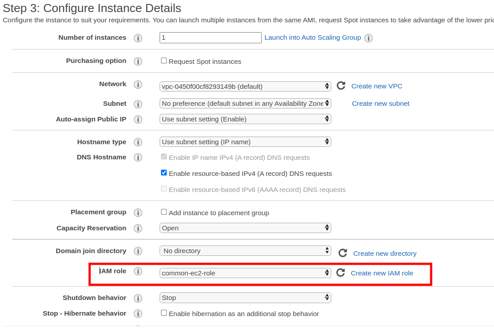
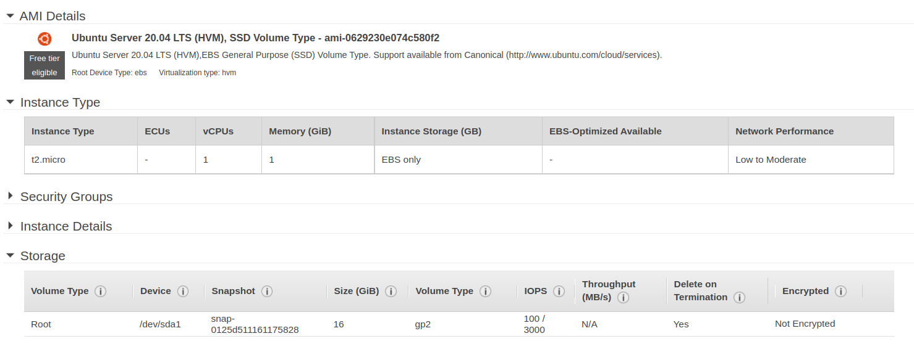
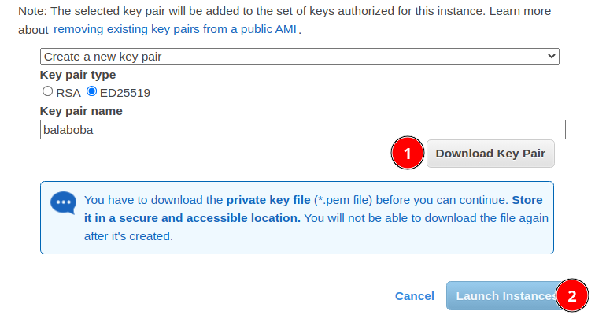
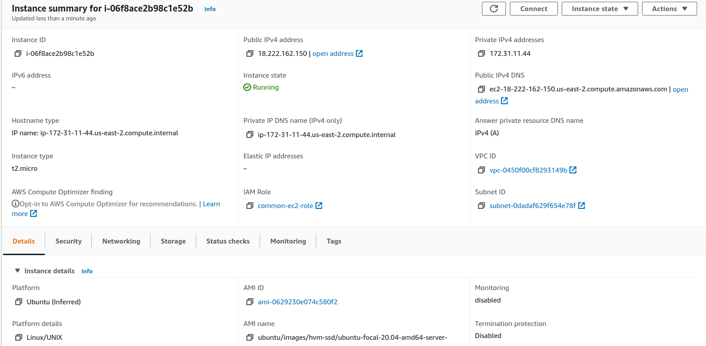
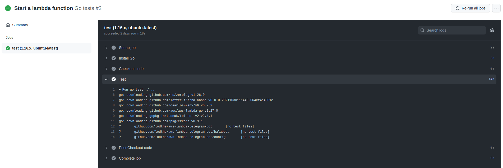
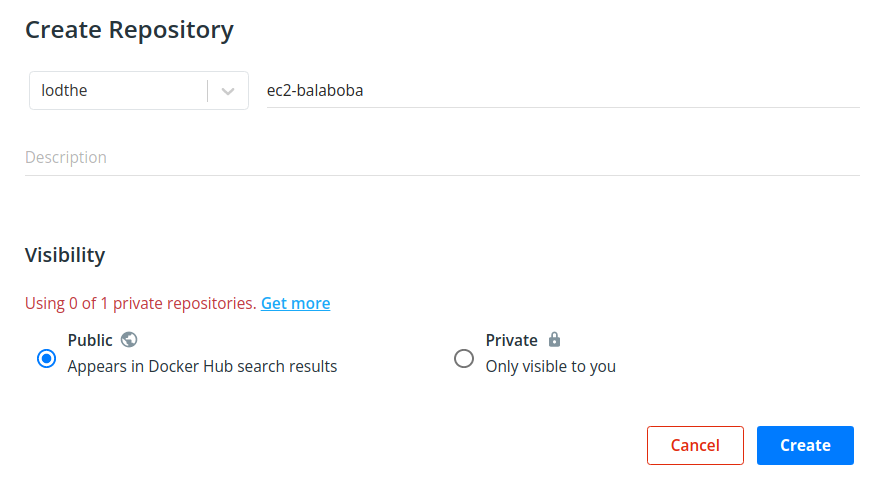
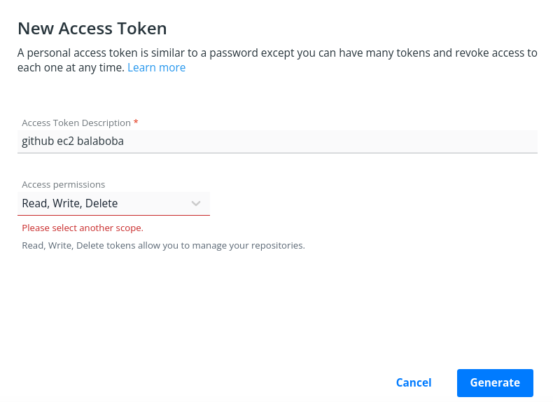
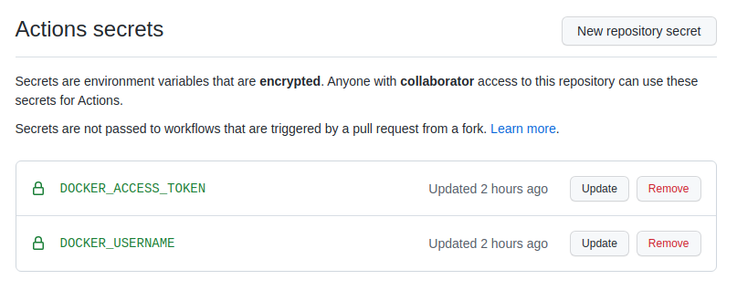
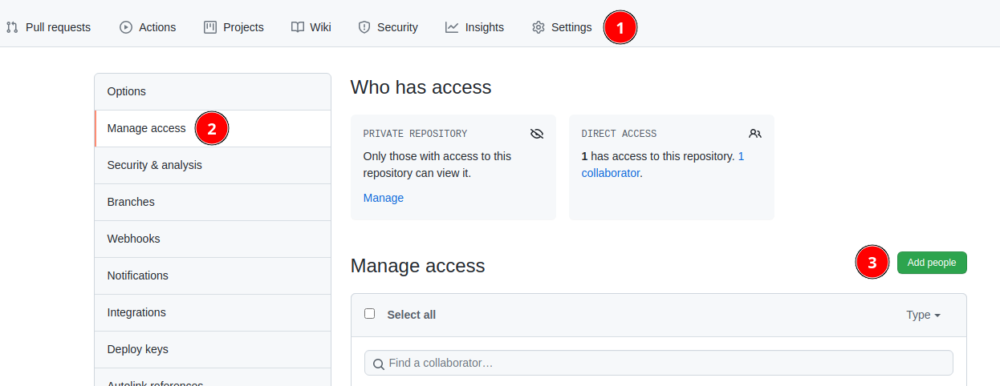

# Деплоим в облако

В этом домашнем задании мы предлагаем вам сделать CI/CD для запуска Telegram-бота на сервере. 

Будет хорошо, если вы придумаете какого-то полезного бота, который облегчит какой-то процесс или будет делать что-то забавное. Но если идей совсем нет, можете взять что-то из этого:
- Боты, которые парсят какие-то сайты.
- Бот, напоминающий про занятия (информацию можно брать из API РУЗа).
- Бот, который следит за новыми мемами в пабликах VK/reddit и постит их в Telegram-канал (заодно можно познакомиться с другими API).
- Бот, скрывающий join-сообщения, когда кто-то присоединяется к чату в Telegram'e.
- Бот для фильтрации мата/языков в Telegram-чатах.
- Бот, следящий за обновлениями Google sheets. Поможет трекать выставление оценок.

В первую очередь, мы хотим, чтобы вы попробовали сделать CI/CD. Поэтому, если не нравится идея с Telegram-ботом, можете предложить что-то своё в чате/личных сообщениях.

Ваше приложение должно будет работать в рамках какого-то облачного окружения. У следующих хостингов есть ограниченный trial-режим с бесплатным использованием:
- [Amazon AWS Free tier](https://aws.amazon.com/free/)
- [Microsoft Azure](https://azure.microsoft.com/en-us/free/)
- [Google Cloud](https://cloud.google.com/free)
- [Yandex Cloud](https://cloud.yandex.ru/docs/free-trial/)
- [DigitalOcean](https://www.digitalocean.com/try/free-trial-offer) (можно получить в рамках [Github Student Developer Pack](https://education.github.com/pack))

Для регистрации необходимо указать данные активной кредитной карты. Не забудьте позже отвязать карту, чтобы после пробного периода не начали списываться деньги. Некоторые банки (например, жёлтый) позволяют выпустить виртуальную карту и временно перевести на неё несколько долларов.

Если вы знаете провайдера, который позволяет бесплатно хостить сервер в течение месяца без указания кредитной карты, сообщите нам.

Дальнейшее повествование будет построено на примере деплоя Telegram-бота в облачное окружение Amazon AWS.

## Что мы получим в конце?

Когда всё будет сделано, вы сможете публиковать изменения на github и новая версия бота будет автоматически запускаться на сервере.

Сценарий доставки приложения будет выглядеть следующим образом:
1. Пользователь пушит изменения в GitHub репозиторий.

2. GitHub Actions запускает различные джобы, которые проверяют, что приложение компилируется, что все тесты проходят, что у линтера нет претензий.

3. В Github Actions запускается джоба, который создаёт докер-образ и публикует его в docker hub репозиторий.

4. На сервере в фоне работает скрипт, который постоянно проверяет docker registry на наличие новой версии образа, и обновляет контейнер, когда такая версия появляется.

Вместо четвертого пункта в более сложных системах обычно используется что-то сложнее. Например, AWS CodeDeploy, ansible, jenkins и др. Мы решили не усложнять домашнее задание, поэтому обойдёмся простым фоновым процессом.

## Создание бота

1. Начните чат с [@BotFather](https://t.me/BotFather).
2. Отправьте "/newbot".
3. Укажите название бота и его юзернейм.
4. Bot-father создаст бота и отправит его токен в формате `1121059367:AAHv0EV36bBRQZVT_LQjIhbYbq-fGVlSEvE`.

Обратите внимание на следующую строку:
> Keep your token secure and store it safely, it can be used by anyone to control your bot.

За хранение токена в коде будет бан.

Также можете кастомизировать своего бота: задать ему описание, аватарку.

## Регистрация в Amazon AWS

1. Заходим на [Amazon AWS Free tier](https://aws.amazon.com/free) и жмём Create a Free Account.

2. Далее указываете информацию, которую от вас просят. В намерениях по использованию указывайте "Personal - for your own projects".

3. В Blling Information необходимо указать данные действующей кредитной карты. Можете использовать виртуальную карту.

4. Подтвердите личностью с помощью SMS или телефонного звонка.

5. В support plan выбираем "Basic support - Free".

6. Регистрация закончена.

Далее вам придет несколько писем на почту, в которых будет указано, что у вас есть 12 месяцев бесплатного использования:
> For the next 12 months, you'll have free access to core AWS compute, storage, database, and application services within the limits of the Free Tier.

Выполните вход в [AWS Console](https://aws.amazon.com/console/) как Root-пользователь.

## Пишем код

[Создайте](https://github.com/new) **приватный** репозиторий на GitHub'e, склонируйте его локально.

Далее необходимо начать писать код приложения. Примеры библиотек с Telegram BOT API клиентами на вашем любимом языке можно найти [здесь](https://core.telegram.org/bots/samples).

Для простоты реализации, мы советуем использовать polling-механизм. Это значит, что ваше приложение будет раз в какой-то период спрашивать у Telegram'a, есть ли новые сообщения, которые надо обработать. Также существует механизм webhook'ов: Telegram сам будет отправлять новые сообщения по URL'у, который вы ему передадите.

Реализуйте базовую версию бота. Например, пусть бот отвечает тем же сообщением, что ему отправил пользователь. Протестируйте её локально. 

Когда базовая версия бота заработает локально, опубликуйте изменения в github-репозитории. Разработку более сложной версии лучше продолжить с настроенным CI/CD, что мы и сделаем в следующих пунктах.

Помните: токен бота не должен храниться в коде. Вы можете получать его с помощью переменных окружения.

## Dockerfile

Чтобы ваше приложение могло работать на других системах, напишите Dockerfile. 

В докерфайле вы должны указать, на базе какого образа будет запускаться приложение (например, ubuntu), какие зависимости нужны приложению (например, python-библиотеке, которых нет в стандартном наборе), какие дополнительные файлы нужны для запуска (например, изображения) и как ваше приложение должно запускаться.

В интернете есть много примеров и туториалов, как писать докерфайл и как запускать контейнер. Например, [туториал для Python](https://docs.docker.com/language/python/build-images/).

В [заметках к лекции про виртуализацию](https://github.com/danlark1/hse_missing_cs_education/tree/master/virtualization) есть описание базовых команд докера. Ознакомьтесь с ними.

Когда закончите, запустите контейнер и проверьте, что бот работает. Опубликуйте докерфайл в ранее созданном репозитории.

## Amazon EC2

**Если вы используете не Amazon AWS, самостоятельно узнайте, как арендовать сервер у вашего провайдера.**

Amazon EC2 (Amazon Elastic Compute Cloud) это сервис, предоставляющий доступ к вычислительным ресурсам в облаке. Грубо говоря, это сервер, на котором мы будем запускать наше приложение.

### Арендуем сервер у Amazon'a

Создайте новый EC2 инстанс:

1. На странице [Amazon EC2](https://console.aws.amazon.com/ec2/v2/home) нажмите Launch Instances.

2. На открывшейся странице слева активируйте чекбокс "Free tier only" и выберите понравившийся образ виртуальной машины. Я буду работать с "Ubuntu Server 20.04 LTS (HVM), SSD Volume Type".

3. Далее выберите доступный free-tier тип инстанса и нажмите Next: Configure Instance Details.


4. На открывшейся странице необходимо создать новую IAM роль:



5. На следующей странице укажите, какой объем дискового пространства вам необходим. Например, 16 GB.

6. На странице с тегами можете добавить тег с названием вашего приложения. Например, у меня это "name: balaboba-bot".

7. В разделе Configure Security Groups ничего делать не надо, оставьте SSH (который там уже есть по умолчанию).

8. Нажмите Preview, проверьте конфигурацию и нажмите Launch:



9. Вам будет предложено создать новую key-пару, с помощью которой вы будете подключаться к машине через SSH. Назовите её как-нибудь и скачайте. После этого можно будет запустить инстанс:



**Поменяйте права доступа к скачанному ключу**:
```bash
chmod 400 <key>.pem
```

Можете вернуться на страницу [EC2 Instances](https://console.aws.amazon.com/ec2/v2/home) и увидеть свой инстанс, который поднимается.

### Подключение к инстансу по SSH

Мы только что создали виртуальную машину, которая работает где-то на серверах амазона. Давайте подключимся к ней через SSH.

Зайдите на страницу EC2 Instances, найдите созданный инстанс и нажмите по его ID. Должна открыться панель управления для этого инстанса:



Найдите пункт Public IPv4 DNS. Рядом с ним указан публичный адрес вашего инстанса, по которому мы можем подключиться к нему через ssh. У меня это, например, `ec2-18-222-162-150.us-east-2.compute.amazonaws.com`.

Чтобы подключиться по ssh, нам также необходимо знать username. Если вы создавали машину на базе образа Ubuntu, это юзернейм будет ubuntu. Ознакомиться с дефолтными юзернеймами для других образов можно на [этой странице](https://docs.aws.amazon.com/AWSEC2/latest/UserGuide/managing-users.html).

Подключиться можно с помощью следующей команды (после флага -i указан путь к ключу):
```bash
ssh -i <key>.pem <username>@<public address>
```

Например,
```bash
ssh -i balaboba.pem ubuntu@ec2-18-222-162-150.us-east-2.compute.amazonaws.com
```

## Непосредственно CI/CD

Что у нас есть на данный момент:
1. Репозиторий с базовой версией.
2. Докерфайл, в котором содержится инструкция, как запустить бота в докер контейнере.
3. Сервер, на котором можно запустить бота (в моем случае, это Amazon EC2).

Уже сейчас процесс разработки может выглядеть следующим образом:
1. Написали код.
2. Проверили, что тесты проходят и линтер не ругается.
3. Сделали push в репозиторий.
4. На сервере сделали git pull.
5. Запустили докер контейнер с новой версией бота на сервере.

Если вы делаете маленькое приложение, код которого почти не обновляется, этот сценарий вас может устроить. Но если приложение разрабатывает целая команды (или команды) людей, то:

- Если делать что-то руками, то высока вероятность что-то забыть. Новый разработчик может попросту не знать, какие проверки надо выполнить.

- Тесты могут работать очень долго или требовать наличия больших вычислительных мощностей, которых у вас на персональном компьютере.

- Разработчику лень делать много рутинных проверок вручную. Разработчик хочет писать код.

Чтобы избавиться от некоторых проблем (и получить новые), можно автоматизировать процессы. Для этого мы настроим CI/CD. Об этом мы уже рассказывали на [одной из лекций](https://github.com/danlark1/hse_missing_cs_education/tree/master/build_systems#ci-%D1%81%D0%B8%D1%81%D1%82%D0%B5%D0%BC%D1%8B).

*Continuous Integration* (CI) &mdash; это процесс интеграции ваших изменений в кодовую базу. К CI относятся проверки вида "после изменений сборка приложения не сломалась", "после изменений тесты проходят".

*Continuous Delivery* (CD) &mdash; это процесс доставки новой версии приложения до пользователей. Это процессы, которые должны быть выполнены, чтобы новая версия приложения была запущена в production-окружении.

Мы будем работать с GitHub Actions. Actions позволяют запускать джобы (или пайплайны) в рамках инфраструктуры гитхаба.

### Continuous Integration

Самостоятельно прочитайте про [Github Actions](https://docs.github.com/en/actions) и про [Docker container action](https://docs.github.com/en/actions/creating-actions/creating-a-docker-container-action). Самостоятельно разберитесь, как этим пользоваться.

Закоммитьте `.github/workflows/main.yml` конфиг, который будет запускать джобу, выполняющую некоторую проверку вашего кода. В зависимости от языка разработки, в рамках джобы вы можете проверять, что код собирается, что код проходит тесты, что линтер не ругается на код, что ваш Dockerfile корректный и позволяет запустить приложение. 

Необходимые acton'ы найдите самостоятельно.

Когда вы запушите новое изменение в репозиторий, в списке коммитов (или во вкладке Actions) вы можете увидеть выполняющуюся джобу. Если спустя время появилась зеленая галочка, это значит, что джоба завершилась успешно:


Если появится красный крестик, значит, что-то сломалось. Вы можете открыть Details, чтобы увидеть логи:



Если у вас заработало всё с первого раза, мы советуем попробовать что-то сломать и закоммитить (например, сломать сборку или тесты), чтобы проверить, что вы настроили CI правильно.

### Continuous Delivery

Теперь сделаем так, чтобы код, прошедший тесты и другие проверки, запускался на сервере. 

На стороне гитхаба нам потребуется сделать workflow, в котором мы будем пушить докер-образ на Docker Hub. На данный момент, большинство публичных образов хранится именно там. [Зарегистрируйтесь](https://hub.docker.com/) на платформе.

Далее перейдите на [страницу с репозиториями](https://hub.docker.com/?ref=login) и нажмите Create Repository. Придумайте название и выберите видимость репозитория (public - доступны всем, private - доступны только вам). По умолчанию, у каждого пользователя есть возможность создать один приватный репозиторий. Если вам важно, чтобы образ с вашим приложением был доступен только вам, создавайте приватный репозиторий.



Теперь зайдите [в настройки](https://hub.docker.com/settings/security) и создайте Access Token, который будет использоваться внутри github workflow.



Временно сохраните токен. Его надо будет указать в сикретах гитхаба.

Зайдите в настройки своего GitHub репозитория, выберите раздел Secrets. Здесь можно указать секретные переменные, к которым можно обращаться внутри workflow, но при этом они видны только меинтейнерам репозитория.

Добавьте сикреты:
- DOCKER_USERNAME &mdash; ваш юзернейм на Docker Hub.
- DOCKER_ACCESS_TOKEN &mdash; access token, который мы только что создали на Docker Hub.



Теперь добавьте job'у, которая делает docker push в созданный репозиторий на Docker Hub:
- Job'a должна запускаться после *успешного* прохождения предыдущих workflow (которые вы добавили раньше).
- Workflow должен триггериться на создание тега или release.

Чтобы узнать, как это делать, ознакомьтесь со следующими туториалами:
- [Release workflow trigger](https://docs.github.com/en/actions/learn-github-actions/events-that-trigger-workflows#release)
- [Publishing Docker images](https://docs.github.com/en/actions/publishing-packages/publishing-docker-images)
- [Wait on check action](https://github.com/marketplace/actions/wait-on-check) (или можете оформить все джобы в одном workflow)

### Запуск контейнера на сервере

Сейчас мы уже умеем пушить образ с приложением в Docker Hub. После каждого деплоя можно заходить на сервер и писать `docker run -it <container_name>:<tag>` (не забудьте передать нужные env-переменные). Но мы автоматизируем процесс запуска новой версии контейнера.

Для начала установите docker на сервере. [Туториал](https://docs.docker.com/engine/install/ubuntu/) для ubuntu.

Ознакомьтесь с [WatchTower](https://containrrr.dev/watchtower/). Этот образ позволяет трекать новые версии образа и автоматически перезапускает контейнер.

Напишите docker-compose.yml, в котором будет сервис вашего приложения и сервис WatchTower. Самостоятельно разберитесь с настройками WatchTower. У меня получилось следующее:
```docker-compose
version: '3'

services:
  bolaboba:
    image: lodthe/ec2-balaboba
    labels:
      - "com.centurylinklabs.watchtower.scope=myscope"
    environment:
      TELEGRAM_BOT_TOKEN: "123123123:FFFFFFFFFFFFFFFFFF"

  watchtower:
    image: containrrr/watchtower
    volumes:
      - /var/run/docker.sock:/var/run/docker.sock
    command: --interval 10 --scope myscope
    labels:
      - "com.centurylinklabs.watchtower.scope=myscope"
```

Для запуска используйте `docker-compose up -d`. Чтобы посмотреть логи, используйте `docker-compose logs -f <service-name>`. Например, `docker-compose logs -f watchtower`.

Запушьте новый тег в GitHub репозиторий. Проверьте, что watchtower запустли новую версию образа.

## Финал

Вы самостоятельно настроили CI/CD для своего кода. Можно сказать, что вы сделали production-ready приложение. 

На самом деле, это очень полезный опыт, который можно указывать в резюме и про который можно рассказывать на собеседованиях.

Добавьте описание вашего проекта в файле README. Расскажите, какие технологии вы использовали. Расскажите о том, что делает ваше приложение и кому оно может быть полезно.

Когда пройдёт дедлайн домашнего задания, вы можете сделать репозиторий публичным, чтобы на него могли посмотреть другие люди :)

P.S. Вот, что получилось у меня: [@queryboba_bot](https://t.me/queryboba_bot).

## Оценивание и требования

- 2 балла за приватный репозиторий github с рабочим ботом.
- 2 балла за наличие Dockerfile, запускающего бота.
- 2 балла за workflow, который проверяет, что код проходит проверку линтера (описано в [Continuous Integration](#continuous-integration)).
- 2 балла за workflow, публикующего образ в Docker Hub после успешного прохождения остальных workflow (описано в [Continuous Delivery](#continuous-delivery)).
- 2 балла за автоматический запуск бота на сервере, когда новый образ публикуется в Docker Hub (описано в [Запуск контейнера на сервере](#запуск-контейнера-на-сервере)).

Каких-то особенный требований к самому боту нет. Если нет идей, пусть бот рандомно отправляет один из десяти мемов.

Также ваш репозиторий должен содержать файл README.md. **Без наличия этого файла ваша работа не будет проверена.** В README файле должно быть:
1. Ваше ФИО.
2. Краткое описание, что делает бот.
3. Если ваш бот запущен на сервере, укажите сервис, у которого вы арендуете сервер (например, Amazon, Google Cloud, ваш собственный сервер, etc.).
4. Если вы реализовали автоматический запуск бота на сервере, опишите ваше решение. Если использовали WatchTower, прикрепите docker-compose файл.

## Сдача домашнего задания

В [choose_reviewer.py](./choose_reviewer.py) замените `Ivan Ivanov` на свое имя и запустите его. Данный скрипт выведет никнейм проверяющего, которого нужно добавить в качестве Collaborator'a в ваш приватный репозиторий:



Никнейм должен быть ровно таким, как в output'e скрипта.

Далее зайдите в список коммитов репозитория и скопируйте ссылку на последний коммит:


Ссылка выглядит примерно так:
```
https://github.com/lodthe/aws-ec2-telegram-bot/commit/8b7563963e6a2a8a0c274ef9ae53e1d976a57a73
```

Заполните [Google-форму](https://forms.gle/gWi3AaWAScMZdhpR6).

Дедлайн домашнего задания: 25 декабря 23:59.